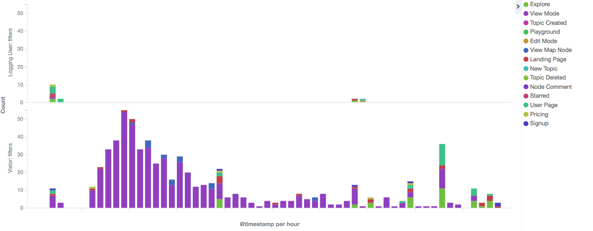
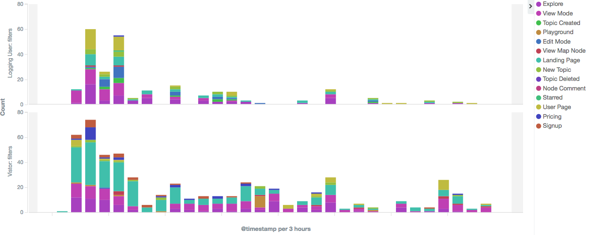
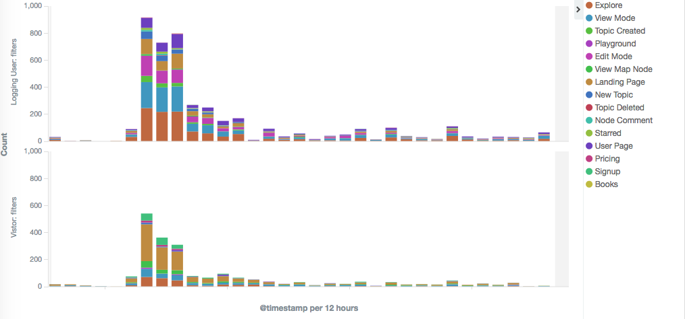

### A marketing efficiency comparison among social platforms, emails on GitHub and influencers

2017-04-03 22:45

My colleagues and I have made some marketing activities to promote our website. There were three main approaches we used. The first was to post a contrived content on social platforms such as Reddit, Twitter, attracting people click the links for leading to our website, the second was to send emails to people who starred a repository on GitHub, so they might like our website. Third, we reached a blogger (influencer) for a post. We got huge different efficiencies after running these three approaches.

Two points we care about:

  1. How many users convert from visitors into logging users? (sign up)
  2. Their behaviors on your website. (activities)

### Social Platforms

We created a content on our website, then shared it to a social platform with content's link and some descriptions. Before posting the content, we've done preparation for log analysis. The log data was converted into charts, so that we can understand what your users are doing on your website. The result shows below with two charts: guests browsing hehaviour and members browsing behaviour.  

Guests from the social platform tend to browse the content and then subsequently leave, only very few guests sign up to become our members. Most of guests do not like explore more. It's make sense, people from social platforms more care about the content than what your website is. The results of first approach, social platform plan, got the bad conversion rate, and guests they don't want to jump to other pages.

### Emails on GitHub

I've written a post to explain how to [explore potential users by an email marketing plan with GitHub]. I won't say too many details on implementation, just show the results below and say some encounters during this.


As opposed to social platforms to get the bad results, we got the better user acquisition by email with GitHub, and people tended to explore more pages. Unfortunately, this plan could only be used once. We got notice from GitHub and SendGrid which is our email service provider. Both of them were notified that we contacted users with unsolicited messages. SendGrid even suspended our service account, which means that our part of business, relative to email, was shutdown immediately. It seems a paradox, people published their contract on GitHub, but they don't want to get news according to their "starred?" So I think the "notified" might be from competitors.

### Influencers

An influential blog writer can help your exposure very well. There was the tremendous acquisition after the blog writer posted the content about our website. We acquired the users by the influencer's post more than 10 times to the plan of email with GitHub. So crazy!

I think, the reason comes down to their influence (the same taste, and trust). Blog writers have been dedicating to their website for their reputations. Writers and audiences, they have the same taste, and audiences trust writers. So when audiences saw a post which is about our website promotion, they willing to try it.

In our cases, the ranking of comparison:

  `influencers` > `emails on GitHub` > `social platforms`

[explore potential users by an email marketing plan with GitHub]:https://yuecen.net/exploring-potential-users-by-an-email-marketing-plan-with-github.html
