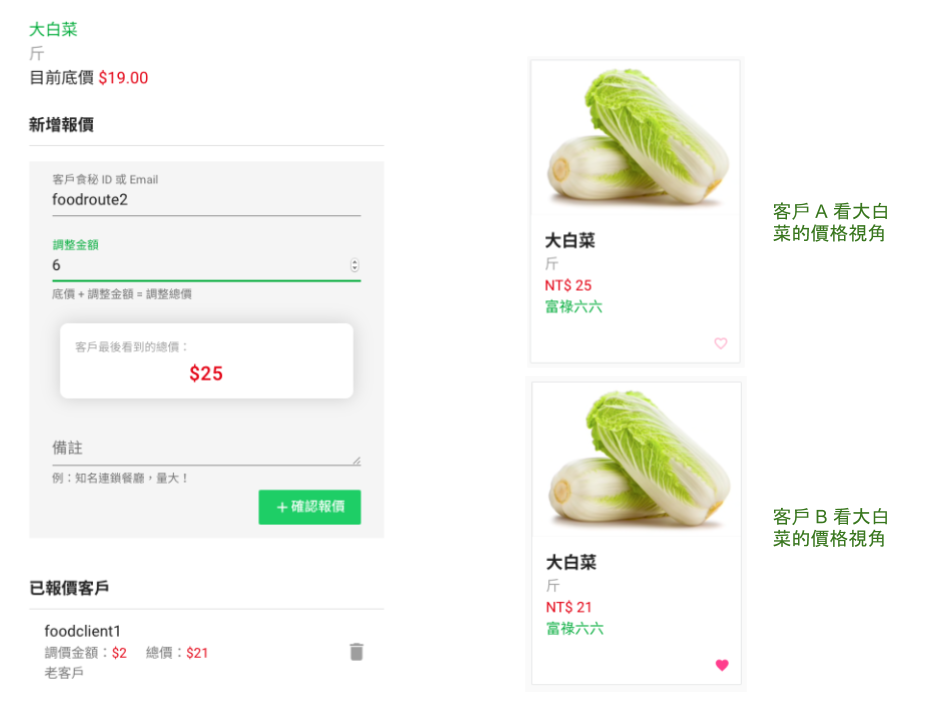

### 實現 B2B 食材電商價格隱蔽性與浮動機制 - 食秘為例

2019.02.01

總結一下去年三月開始在加速器開發 B2B 食材電商網站[食秘]的一些心得。在 B2B 食材的世界中，價格是關鍵的角色，有兩個重點：第一，食材供應商對不同餐廳同一食材的定價是不一樣的。例如，因為某些餐廳距離較遠，採購量又不足，需要較多的成本，供應商自然給予該餐廳較高的價格。第二，某些食材價格會波動。例如，菜價經常受到天候影響價格，供應商需對旗下餐廳客戶修改報價。一般的 to C 的電商平台沒辦法解決這兩個最關鍵的問題，於是我們針對這兩點提出解決方案。身為程序猿後面還是會帶到一點使用的技術棧。

#### 價格隱蔽性

顧名思義，一開始我在電商網站上看不到商品（食材）價格，但要如何獲取價格呢？就是直接詢價。所以在食秘上設計了即時通訊的功能，讓餐廳可以將所要的食材種類、量、單位、送貨時間、送貨地點等條件，在聊天功能內跟供應商互相確認，隨後供應商可以直接針對該餐廳設定這個商品的專屬價格，這個專屬價格有兩個組成：`底價`＋`各別定價`。

同樣的，另外一家餐廳也來詢價後，供應商根據他的條件設定各別定價，於是得到了兩家餐廳對於同樣商品的價格是有差異化的，如下圖，底價 19 元的大白菜，在對兩家不同餐廳的定價會有差異，導致一家看到的大白菜是 25 元，另一家是 21 元。

#### 浮動價格機制

針對菜價波動後，如果想要調整價格可以直接對底價進行修正，如此一來，不用個別通知那些底下的餐廳用戶，餐廳在網站上可以直接同步到最新的定價下單，如還是有疑慮在自行聯絡供應商即可，省去很多溝通成本。

#### 使用技術棧

團隊只有我一人是開發，所以使用的技術是我自己最熟悉的語言。也特別感謝一位當時國三學生[庭瑋]在暑假的時候來團隊玩 Vue.js，也協助一些前端開發，分擔我的 loading。

* 前端 Vue.js (包含 Vuex)
* 後端 Python, Django REST Framework, ASGI (為了前端串 WebSocket 達到即時通訊)
* 資料庫 PostgreSQL, Redis
* 雲服務 AWS
* 第三方 API 串接 LINE Login

開發使用前後端分離的的架構，花比較多時間的除了前幾節提到的即時通訊、個別定價，食秘甚至已經做到了簡單的成本分析，不過我並沒有使用之前常用的 Elasticsearch aggregation，而是直接使用 Django 提供的 annotate 簡化架構。

另外，系統內沒有金流串接，因為多數供應商還有店家的的付款習慣還是習慣現金或是月結，我們目前只負責資訊流單據的拋轉。

#### 小結

對於價格的隱蔽性與浮動機制，上述只是食秘提供的解法，不代表一定適用所有供應商的狀況。老實說，要做到整合眾多的供應商與餐廳這條路，比想像中還要艱辛，系統從無到有歷經八個月一人開發出上述的初版，自己也成長了很多，但現在的人力與資源實在是非常吃緊，以系統為發展的方向，勢必要補足團隊技術成員來分擔 loading，開發時程與生活經濟壓力同時下來，還是要先避免餓死。

離開加速器後，食秘進行了不少商業模式的討論與測試，最後，我們調整商業模式到一個能夠收到錢，又不至於一定要等所有功能都開發完成才能推廣的狀態，開啟了另一個題目[食材找找]，這又是另外一個故事了。

[食秘]:https://www.foodroute66.com
[庭瑋]:https://github.com/wilicw
[食材找找]:https://food-map.io
