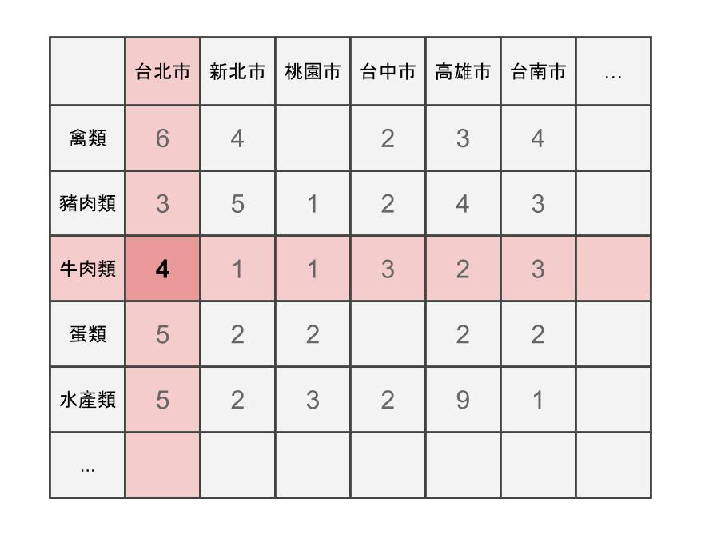
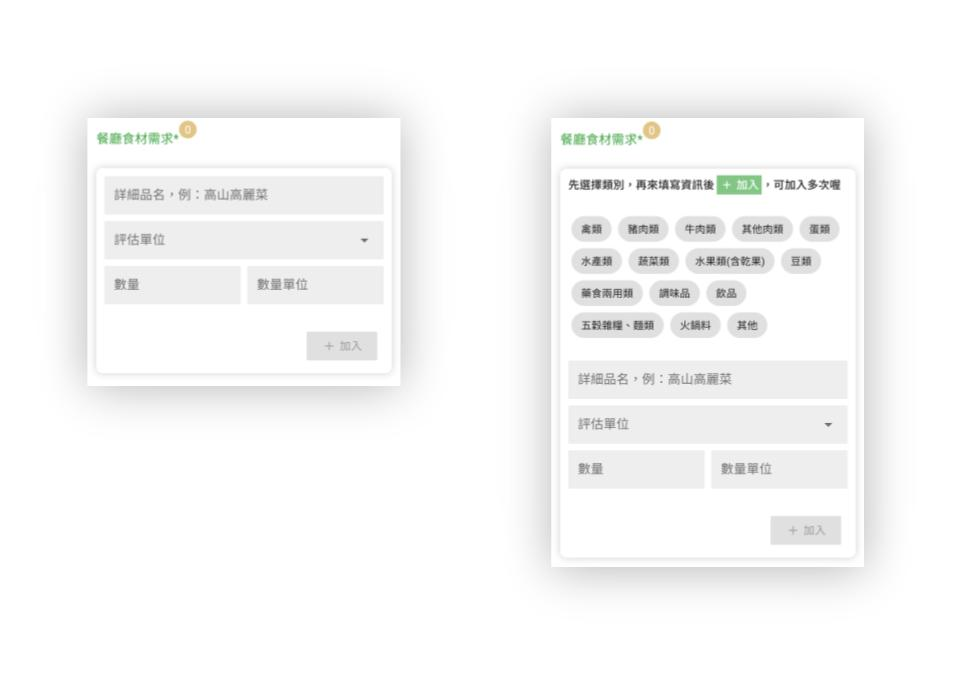
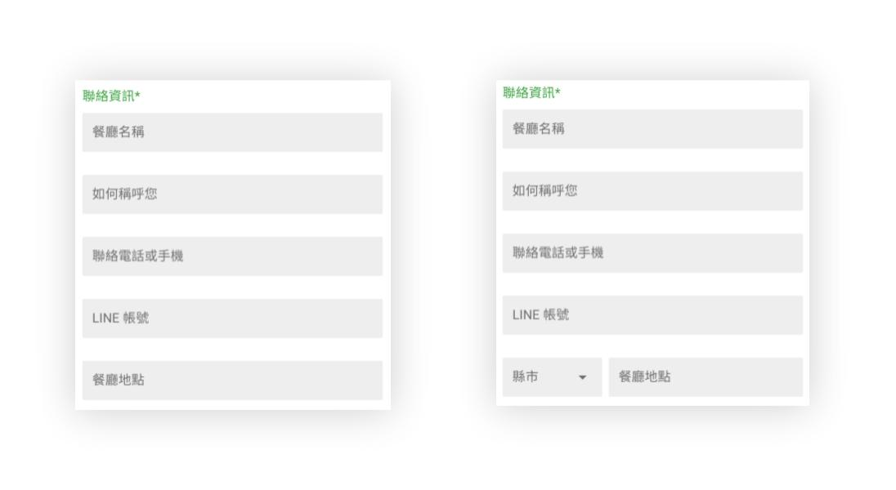
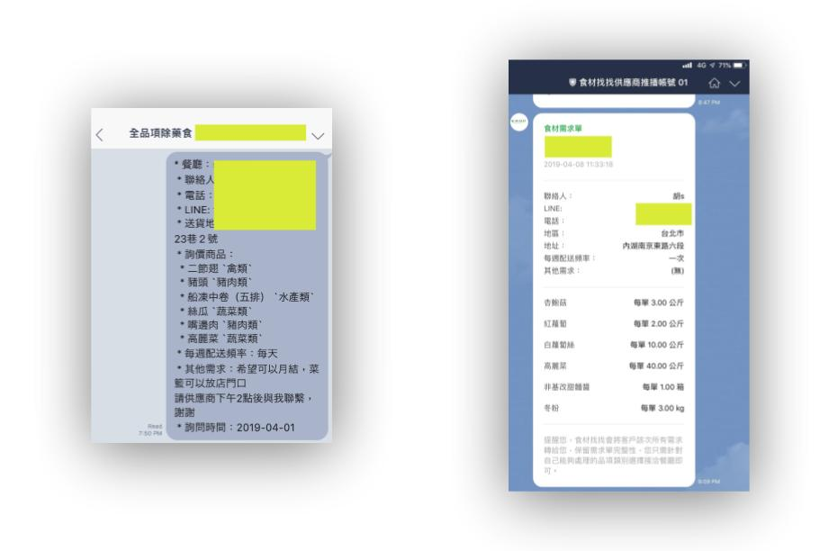
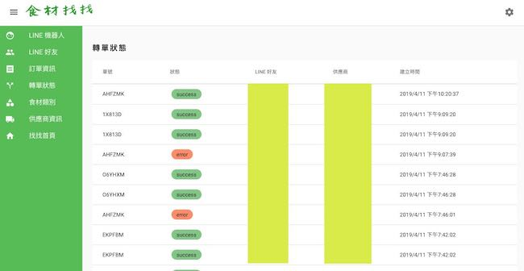

### 對食材供應商逐步實現自動化轉單

2019.04.11

食材找找上線三個多月了，很幸運的團隊找到一個小的施力點："轉單"，讓我們能夠在食材供應鏈上提供價值給餐廳與供應商，重要的是，這個價值能夠被兩端的朋友肯定且願意付費。這篇是記錄一下食材找找怎麼處理轉單這件事，因為是個人部落格，會說明如何運用一些自動化的技術將大量的人工流程消除，使團隊成員有更多的時間去開發業務。

#### 核心服務

食材找找上面核心服務是：

> 將餐廳找食材的需求轉給符合需求的食材供應商。

所以在網站上主要就一個 landing page 配合一個表單，服務就是那麼簡單，你可能會說，這樣跟餐廳自己找有什麼差別？當然有差別：

* 多數供應商業務流程還是用電話，有的供應商忙，經常漏單，所以餐廳常常是被動方
* 你不知道有哪些供應商可以選擇，有些供應商網路曝光度很低，初入市場的餐廳可能會找不到
* 供應商可能不會送你餐廳的區域，好不容易聯繫到供應商，最後他跟你說太遠不送
* ...

我們不只幫餐廳找到供應商，**而且是可以負責報價的接單人員**，我們也不斷補齊加入各個區域的供應商，以免無法滿足不同區域的需求。

#### 進入市場

前幾個禮拜我們系統連資料庫都沒有，就僅僅是串 Trello API, 然後再在 Trello 上面看單作業，後來才陸續的補齊資料庫跟其他功能。

作業流程大概是：用戶填單了，我們得知有家餐廳要買高麗菜，我就把這個資訊轉發給高麗菜合作廠商，然後記錄在 Trello 上面讓大家知道，處理完就將 card 移動到下一階段。而且我們只用 LINE 轉單，因為：

> LINE 的出現挹注資訊元素到傳統食材供應鏈。很多餐飲業的大哥大姐不用臉書、Google 搜尋、連 Email 都沒有，但卻會用 LINE!!!

疑？這個餐飲食材供應鏈的人幾乎都會有使用 LINE 哇！這個市場已經是這樣了，我們就配合他們熟悉的方式進行，沒必要硬要用 email 之類的其他方式。

#### 吃力了

後來單量變多了，接單業務越來越吃力，有多吃力？我打個比方：

> 一家餐廳下了訂單有五個品項，每個品項要推薦至少四個供應商。5 x 4 = 20 個手動轉單作業

更何況每天又不只一單，是好幾單啊，對照供應商與品項時出錯很常見。從人工判讀，到轉單完成，業務經常一天幾小時就不見了。

團隊很小，只有三個人。這種手動轉單工作能不能自動化完成？讓大家有更多時間去開發業務。

#### 來自動化吧

自動化的概念可以用下面的品項與地區的矩陣解釋，雖然實作上跟這個矩陣沒什麼關聯，但思考上可以借用幫助理解。我們把現在表單上的食材品項添加了食材類別這個元素，又把區域元素從地址上獨立出來。

資料庫收到訂單的時候，根據上述兩個元素可以自動的找到 4 個供應商（以下圖為例），並且用 LINE API 轉單給供應商。當然，我們的付費用戶會優先轉發。

下圖左邊是原來的表單資訊，右邊是修改後多出類別選項。

下圖左邊是原來的表單資訊，右邊是將地區的資訊抽出獨立。

下圖左邊是原來轉單的文字訊息，右邊是串 LINE Flex Messages API 美觀後的訂單。

#### 一點技術細節

網站後台的前端是 Vue.js，後端是用 Go 完成，不使用任何 ORM，我喜歡寫 SQL (誤)，後端幾乎都是使用 Go 的標準庫完成的。而轉單排程處理是在服務啟動的時候，也一並啟動一個專門服務跑單的 [goroutine]，然後後台會有轉單狀態的頁面可以監控有沒有失敗的單據，以利除錯。

食材找找有後台給內部人員使用，包含供應商轉單等業務，且支援多個 LINE 官方帳號，我可以把很多開發者帳號加起來不受到 50 人好友上限的限制，又能無限發送訊息，但可惜目前 LINE 2.0 修改了很多 API 收費標準，看來未來平台又會有一筆其他的支出。

[goroutine]:https://tour.golang.org/concurrency/1
